# Olivia — Full Architecture Design (Vercel Stack)

This document describes the **target production architecture** for the Olivia AI Product Ad Generator: hosting on **Vercel**, object storage on **Vercel Blob**, serverless API routes in **Next.js 14 (App Router)**, and **external AI / supporting services** where Vercel does not provide equivalents.

It is aligned with the current codebase layout (`app/`, `lib/`, `components/`), `vercel.json`, and project documentation. Use the Mermaid blocks directly in [Eraser.io](https://eraser.io) (Mermaid import or embedded diagram).

---

## 1. Executive summary

Olivia is a **browser-first** web application. The **Next.js** app serves the marketing home page, the **editor** workspace, and **Route Handlers** under `/api/*`. Heavy work (vision analysis, orchestration, image generation, image processing) runs in **Vercel Serverless Functions** with bounded timeouts. **Binary assets** (uploads, generated ads, intermediate PNGs) live on **Vercel Blob** with HTTPS URLs passed between client and APIs. **Anthropic Claude** provides multimodal reasoning and agent-style decisions; **Replicate** runs diffusion and optional background-removal models. **Upstash Redis** (optional but recommended in production) backs **sliding-window rate limiting** shared across serverless instances.

---

## 2. Design principles

| Principle | Implementation |
|-----------|----------------|
| Stateless API tier | No mandatory app database; generation and session state primarily client-held |
| Durable media | Vercel Blob for uploads and generated images referenced by URL |
| Long-running generation | `vercel.json` extends `maxDuration` for `/api/generate` (see repo config) |
| Streaming UX | `/api/iterate` returns **SSE** for incremental thinking and results |
| Defense in depth | Rate limits, CORS tied to `NEXT_PUBLIC_APP_URL`, CSP headers in `vercel.json`, Zod validation on inputs |
| Observability hooks | `GET /api/health` for capability flags; optional Vercel Analytics / Speed Insights (not required by code) |

---

## 3. Logical architecture layers

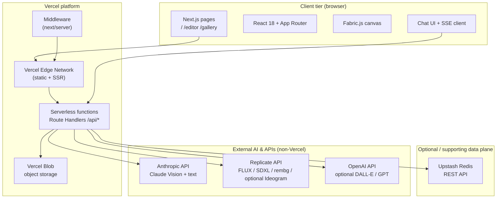

---

## 4. Vercel platform components (what runs where)

| Vercel capability | Role in Olivia |
|-------------------|----------------|
| **Vercel Hosting** | Git-connected deployments; preview + production URLs |
| **Next.js Runtime** | SSR/SSG pages, Server Components, client bundles |
| **Serverless Functions** | Each `app/api/**/route.ts` becomes a function; cold starts bounded by region (`vercel.json` → `iad1`) |
| **Vercel Blob** | `POST /api/upload`, `lib/blob-storage.ts` — product images, generated creatives, iterate outputs |
| **Edge CDN** | Static `_next/static` caching headers in `vercel.json` |
| **Middleware** | `middleware.ts` — lightweight request shaping (e.g. favicon redirect) |
| **Environment variables** | Secrets for Anthropic, Replicate, Blob token, optional Redis, `NEXT_PUBLIC_*` |
| **GitHub integration** | Push → build → deploy; CI/CD workflows in `.github/workflows/` |

**Optional Vercel add-ons** (not wired in code but common for submissions / production hardening):

- **Vercel Analytics** — traffic and Web Vitals  
- **Speed Insights** — real user performance  
- **Vercel KV** — alternative to Upstash for small key-value (not used in this repo today)

---

## 5. External services (AI & non-Vercel)

| Service | Responsibility |
|---------|----------------|
| **Anthropic** | Product image analysis, prompt orchestration, iteration interpretation, optional short streaming copy via AI SDK |
| **Replicate** | Image generation (FLUX Schnell / FLUX Pro, etc.), optional Ideogram routing, background removal models |
| **OpenAI** | Optional fallback image or text capabilities per `lib/ai/image-generator.ts` / env |
| **Upstash** | Redis-compatible HTTP API for **rate limiting** (`@upstash/ratelimit` + `@upstash/redis`); in-memory fallback when unset |

---

## 6. Application modules (code map)

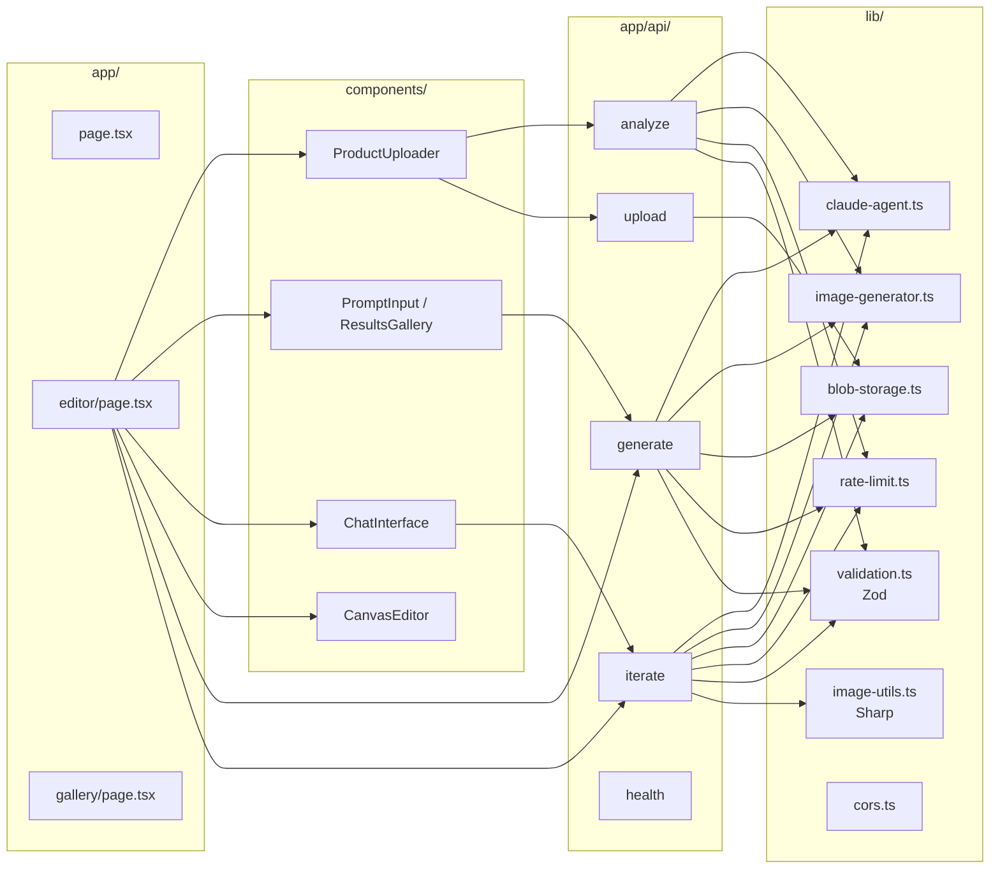

---

## 7. Deployment & CI/CD (repository automation)

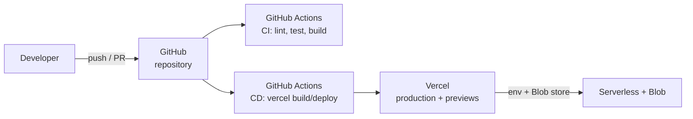

CI (`.github/workflows/ci.yml`): Node 20, `npm ci`, type-check, lint, unit tests, `npm run build` with secrets for build-time env.

CD (`.github/workflows/cd.yml`): build, `vercel pull` / `vercel build --prod` / `vercel deploy --prebuilt --prod` using `VERCEL_TOKEN`, `VERCEL_ORG_ID`, `VERCEL_PROJECT_ID`.

---

## 8. Runtime deployment view (Vercel-centric)

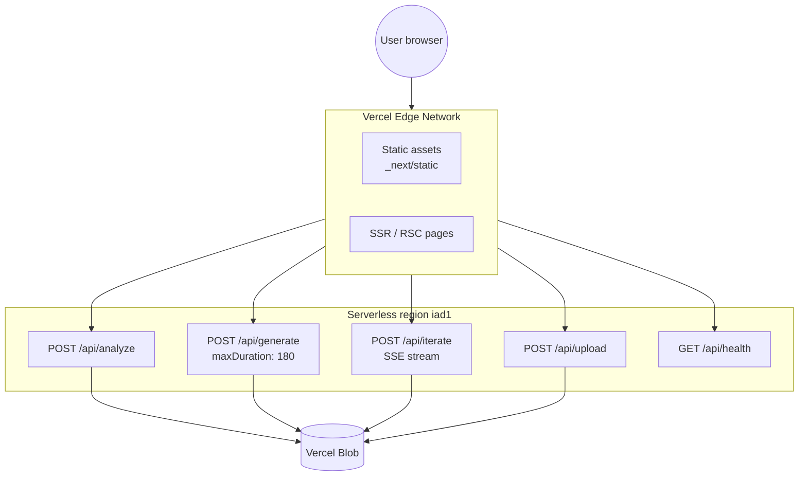

---

## 9. Data & asset flow

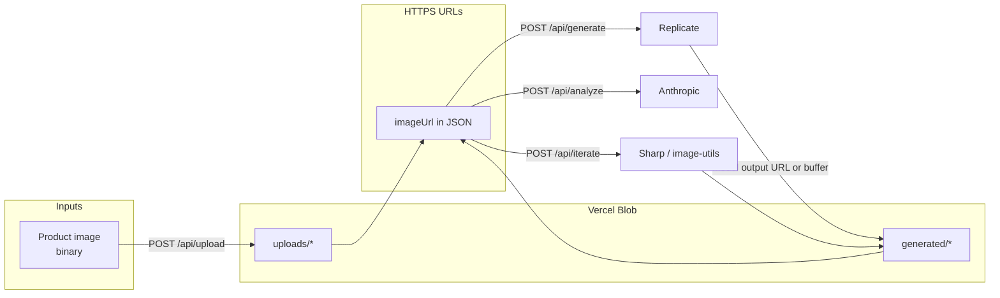

---

## 10. Sequence — Upload and analyse

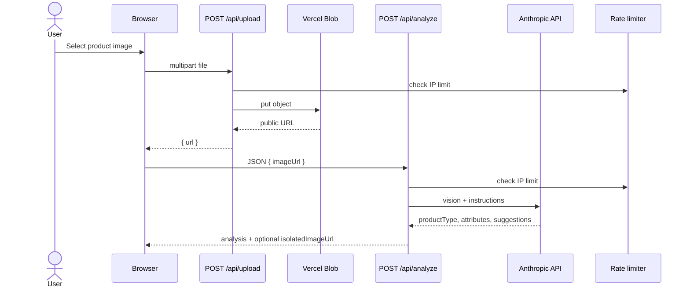

---

## 11. Sequence — Generate variants

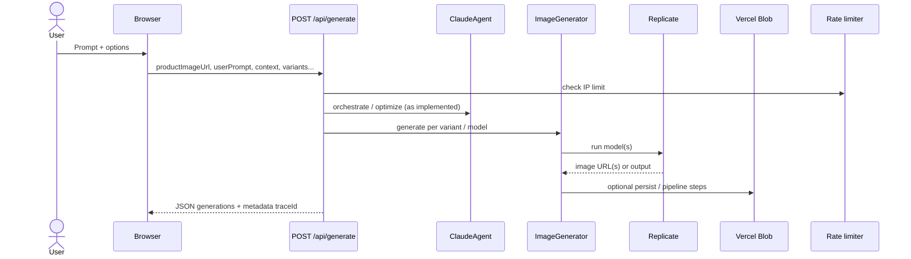

---

## 12. Sequence — Conversational refine (SSE)

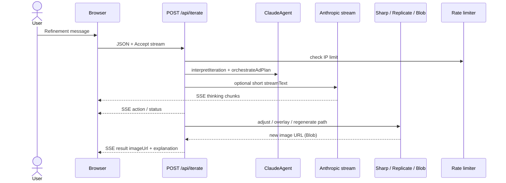

---

## 13. Security & cross-cutting concerns

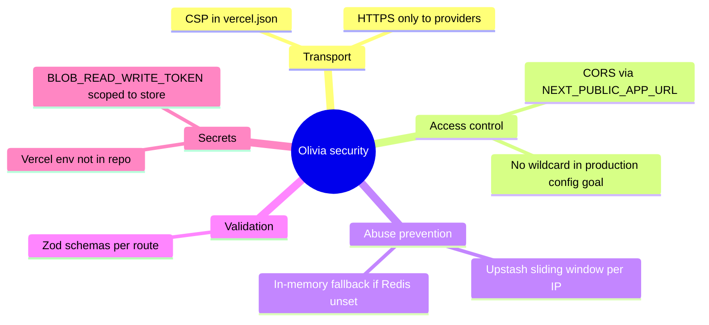

---

## 14. Component inventory (submission checklist)

| Component | Technology | Hosted by |
|-----------|------------|-----------|
| Web app | Next.js 14, TypeScript, React 18 | Vercel |
| Styling / UI | Tailwind, shadcn/ui, Framer Motion | Vercel (static) |
| Canvas | Fabric.js 7 | Browser |
| Product analysis API | Route Handler + Claude | Vercel Function → Anthropic |
| Generation API | Route Handler + Replicate + Claude | Vercel Function → Replicate / Anthropic |
| Iterate API | Route Handler, SSE | Vercel Function |
| Upload API | Route Handler + `@vercel/blob` | Vercel Function → Blob |
| Object storage | Vercel Blob | Vercel |
| Rate limiting | `@upstash/ratelimit` | Upstash (HTTP) |
| Image processing | `sharp`, custom utils | Vercel Function (memory/CPU limits apply) |
| Validation | `zod` | Bundled in function |
| Unit tests | Vitest | CI runner |
| E2E tests | Playwright | CI runner |
| Build / deploy | GitHub Actions + Vercel CLI | GitHub + Vercel |

---

## 15. Future architecture options (not in scope of current code)

These are **logical extensions** for coursework or v2:

- **Vercel Postgres / Neon** — user accounts, saved projects, billing  
- **Vercel KV** — server-side session or feature flags  
- **Queue / workflow** — Vercel does not provide a first-class job queue; **Inngest**, **Trigger.dev**, or **Cloudflare Queues** could offload long pipelines  
- **CDN caching** of third-party model URLs — careful TTL; prefer Blob as canonical store  

---

## 16. System context — portable flowchart (recommended for Eraser.io)

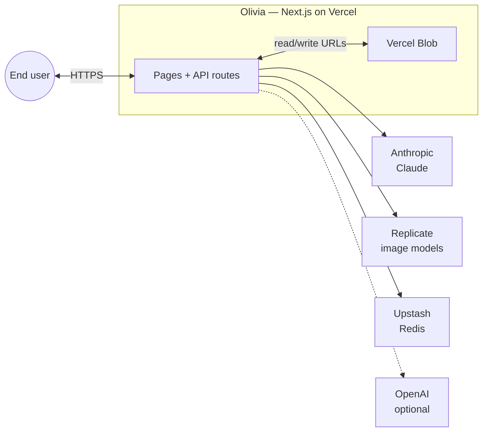

### 16b. C4-style context (optional — requires C4 support in your renderer)

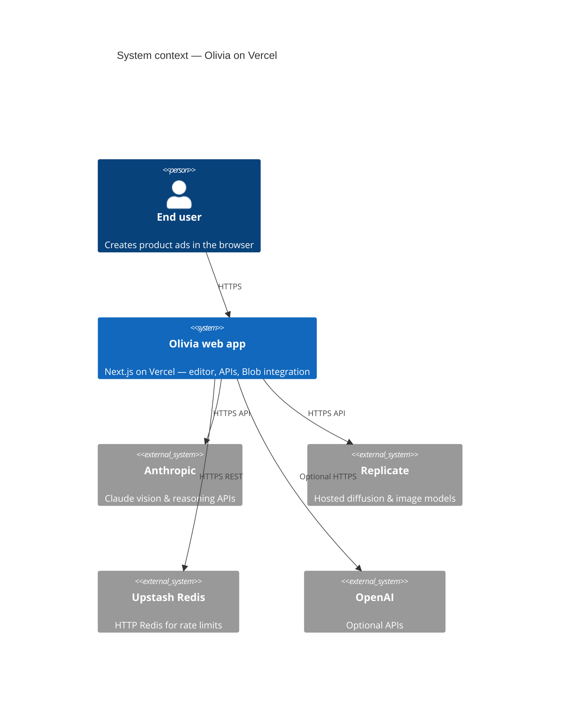

> If Eraser does not render **16b**, use **Section 16** or **Section 3** only.

---

## 17. Document control

| Field | Value |
|-------|--------|
| Product | Olivia — AI Product Ad Generator |
| Primary host | Vercel |
| Storage | Vercel Blob |
| Source of truth | Repository `README.md`, `vercel.json`, `app/`, `lib/` |
| Last updated | 2026-04-27 |

---

*End of architecture document.*
